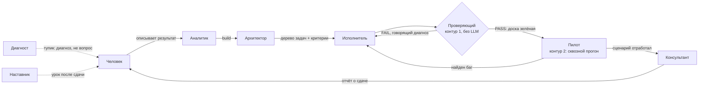

# LOOM v5

**Автономный AI-инженер уровня middle.** Человек описывает желаемый результат
на естественном языке — LOOM сам проектирует, пишет, проверяет и чинит код,
пока не получится работающий продукт. Без черновиков и без пошаговых
инструкций от человека.

> Формула: тимлид (человек) приносит **«что хочу на выходе»** → LOOM берёт всё
> **«как»** на себя → возвращает **работающий продукт**, а не набросок.

## Идея

Между человеком и AI-исполнителем (Claude Code, Codex, Cursor…) обычно должен
сидеть инженер: понять задачу, разложить на шаги, написать код, проверить,
починить. LOOM занимает место этого инженера — по правам и границам это
middle: берёт понятную задачу и доводит её до результата сам, разбирается в
незнакомой области, но не оспаривает продуктовые решения тимлида и не задаёт
уточняющих вопросов «на всякий случай».

## Как это устроено

Один координатор без LLM гоняет детерминированный цикл `захват задачи →
роль → вердикт → следующий шаг`. Сам код (в `core/`) не содержит интеллекта —
все решения принимают роли, каждая — отдельный вызов модели через единый
шлюз (`core/gateway.js`), который под капотом дергает Claude CLI отдельным
процессом на каждый вызов.



### Роли (JSON-конфиг + общий движок, роли друг друга не вызывают)

| Роль | Что делает | LLM |
|---|---|---|
| Аналитик | понимает вход, различает build / вопрос / правку / менторский разбор | Opus |
| Архитектор | выбирает подход, режет на задачи с критериями приёмки | Opus |
| Дизайнер | дизайн-система (только для `domain=ui`) | Opus → Sonnet |
| Исполнитель (`coder`) | пишет код одной задачи; видит только её, не весь план (защита от goal drift) | Sonnet → эскалация на Opus |
| Проверяющий (`checker`) | контур 1: детерминированный прогон критериев приёмки, отдельный чистый процесс | — (без LLM) |
| Пилот | контур 2: реальная эксплуатация продукта по сценарию из ТЗ после того, как доска зелёная | Sonnet |
| Диагност | если LOOM упёрся — свежий взгляд, приносит диагноз, а не вопрос | Opus |
| Консультант | формирует итоговый отчёт о сдаче | Sonnet |
| Наставник | единственная роль вне продукта — разбор и обучение самого LOOM | Opus |
| Координатор | детерминированный цикл без LLM: `claimNext → роль → вердикт` | — (без LLM) |

### Что защищает от типичных провалов автономных агентов

- **Path lock** — Исполнитель физически не может записать файл вне
  `projects/<id>/`.
- **Два независимых контура проверки** — код нельзя «уговорить»: Проверяющий
  без LLM сравнивает факт с ожиданием и печатает говорящий провал
  (условие + фактические значения), Пилот отдельно прогоняет продукт по
  сценарию использования.
- **`.history`-бэкап** перед каждой перезаписью файла + git-коммит на каждую
  попытку внутри `projects/<id>/`.
- **Контекст без переполнения** — первый ход отдаёт полный снимок, дальше
  только дельта изменений; Исполнитель не видит весь план, только свою задачу.
- **Постоянная память** — уроки в `core/lessons.js` пишутся только с
  подтверждения человека, а не из догадок модели.

## Технологии

Node.js (ESM, `--env-file`), Claude Code CLI как единственный провайдер
модели (`core/gateway.js`, HTTP-ветка на прямых API-ключах подготовлена, но
выключена), SQLite-журнал (`better-sqlite3` с фолбэком на встроенный
`node:sqlite`), git как слой версионирования каждого продукта,
`node:test` для тестов (без mock-режима — фейковый `claude` в `PATH`
подставляется только в тестовом харнесе).

## Быстрый старт

Требуется установленный и авторизованный [Claude Code CLI](https://docs.claude.com/claude-code) в `PATH`.

```bash
npm install
cp .env.example .env      # LOOM_HOME не обязателен; ANTHROPIC_API_KEY нужен
                           # только выключенной HTTP-ветке шлюза
npm run talk               # основная сессия: строить / спрашивать / править
npm run resume              # доработать доску после перерыва или падения
npm run mentor               # разбор с Наставником после сдачи
npm test                      # node:test, --test-concurrency=1
```

Внутри `talk` не нужны отдельные команды на «спросить» или «поправить» —
Аналитик сам определяет тип запроса первым вызовом. Доступны только
`/status`, `/projects`, `/project <id>`, `/mentor`, `/help`, `/exit`.

## Структура репозитория

```
core/       механика без интеллекта — журнал, координатор, шлюз, path lock,
            дельта контекста, история правок, постоянная память
agents/     роли — каждая: промпт + движок + парсинг ответа
prompts/    статичные системные промпты ролей (кэшируются)
bin/        три точки входа: talk / resume / mentor
tests/      node:test + подставной claude в PATH для детерминированных тестов
docs/       LOOM_TZ_v5.md (что и почему), LOOM_BUILD_GUIDE.md (как и в каком
            порядке), DECISIONS.md (журнал решений), RUNBOOK.md (реальные
            прогоны каждой фазы, без имитаций)
projects/   продукты, которые построил LOOM (не хранится в репозитории)
```

## Статус

Проект в активной разработке по фазам — список того, что реально прогонялось
на каждой фазе (не имитация), веду в [`docs/RUNBOOK.md`](docs/RUNBOOK.md).
Обоснования ключевых решений и разобранные тупики — в
[`docs/DECISIONS.md`](docs/DECISIONS.md). Полная спецификация — в
[`docs/LOOM_TZ_v5.md`](docs/LOOM_TZ_v5.md).
